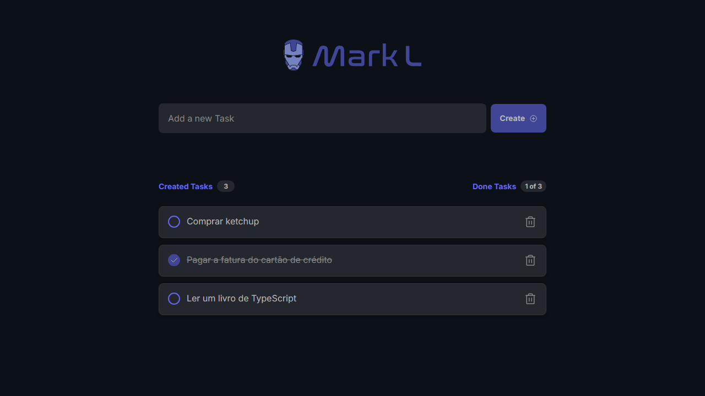

<div align="center">
  <h1 align="center">
    Automação Mark L
    <br />
    <br />
    
    <br />
  </h1>

  <h2> 
  
  :white_check_mark: Projeto finalizado
  </h2>
</div>


---

# :file_folder: Índice 

- [Descrição do Projeto](#id01)
- [Ferramentas](#id02)
- [Desafio](#id04)
- [Instalação](#id03)

---

# :pushpin: Descrição do Projeto <a name="id01"></a>
Construir um projeto de testes de ponta a ponta para aplicações web, automatizar testes de regressão com Playwright, preencher formulários automáticamente, boas práticas para implementação de testes automatizados, como validar o comportamento esperado, automação de ações que o usuário realiza em um navegador da Web, como testar aplicações simulando um ambiente real e as vantagens ao usar Typescript para testes automatizados.
Pra fazer tratamento de faker, utilizar esse site "api" https://v9.fakerjs.dev/api/

---

` Curso: ` Udemy - Playwright eXpress

---

# :computer: Ferramentas<a name="id02"></a>

<div style="display: flex; gap: 10px;">
  
  
</div>


---

# 🎯 Desafio <a name="id04"></a>


---
# 🗂 Instalações <a name="id03"></a>
#### Baixar Projeto e instalações
```bash
    # Clonar o repositório
    $ git clone https://github.com/Amanda92Cortez/udemy-mark-papito.git

    # Entrar no diretório
    $ cd nomePasta

    # Inicar configuração Playwright
    $ npm init playwright@latest ou yarn create playwright
    # Opção TypeScript > tests > Github: False > Install > true

    # Configuração .env, Melhoria de link API no código
    $ yarn add dotenv -D
```

#### ❎ Rodando o Back-End (servidor)

```bash
    # Entrar no diretório
    $ cd apps

    # Vá para a pasta api
    $ cd api

    # Instale as dependências, adicionar sqlpite3 e configurar banco de dados
    $ yarn install
    $ yarn add better-sqlite3
    $ yarn db:init

    # Execute a aplicação em modo de desenvolvimento
    $ yarn dev

    # Ter informações aleartórios Faker
    $ npm i @faker-js/faker ou yarn add @faker-js/faker
```

#### ❎ Rodando o Front-End (web)

```bash
    # Entrar no diretório
    $ cd apps

    # Vá para a pasta web
    $ cd web

    # Instale as dependências 
    $ yarn install

    # Execute a aplicação em modo de desenvolvimento
    $ yarn dev
```

#### ❎ Rodando automação (Playwright)

```bash
    # Executar Teste
    $ yarn/npm playwright test
    $ yarn playwright test --headed

    # Ver Relatório
    $ yarn playwright show-report
    
    # Na configuração playwright.config.ts dentro 'use' acrescentar esse comando headless: false para abrir navegação

    # Comandos, observação: quando for instalação npm os comandos serão exibidos diferença
    $ yarn playwright test
    
    # Runs the end-to-end tests.
    $ yarn playwright test --ui
    
    # Starts the interactive UI mode.
    $ yarn playwright test --project=chromium
    
    # Runs the tests only on Desktop Chrome.
    $ yarn playwright test example
    
    # Runs the tests in a specific file.
    $ yarn playwright test --debug
    
    # Runs the tests in debug mode.
    $ yarn playwright codegen
    
    # Auto generate tests with Codegen. We suggest that you begin by typing:
    $ yarn playwright test

```

---

Feito pela Amanda Cortez 👋🏽 [Acesse meu linkedin!](www.linkedin.com/in/amandacortez92)